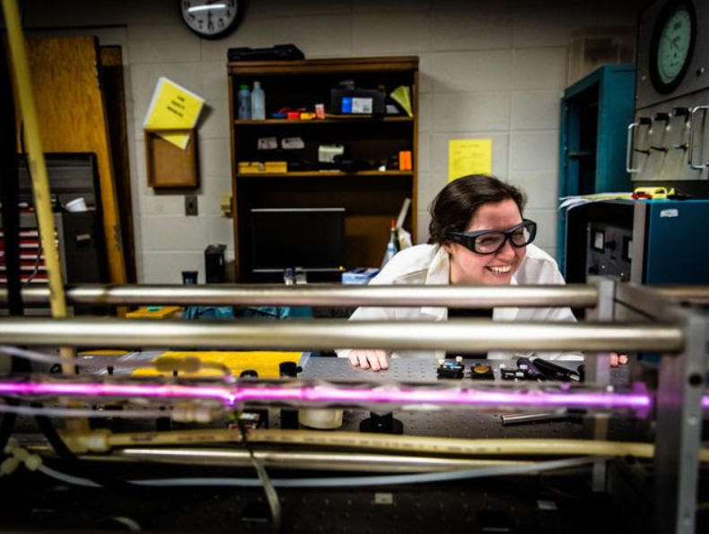
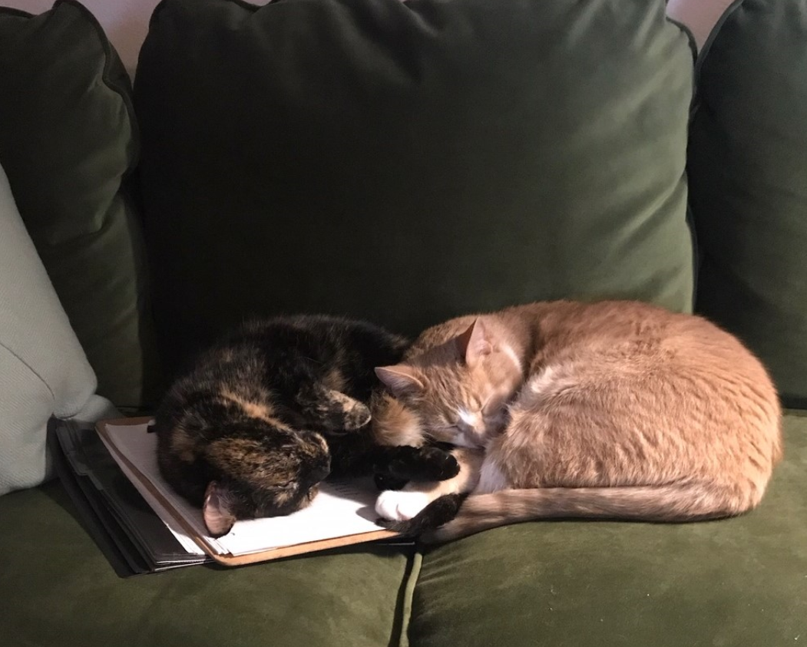

Some information about me!

### Education

I went to [UNC Asheville](unca.edu) for undergrad where I majored in both Physics and Math. I was president of the Society of Physics Students, where I helped to design and implement a program to introduce visiting middle schoolers to physics (and gave us an excuse to play with liquid nitrogen). I also headed the laser lab, where I ran an experiment that attempted to synthesize graphene via laser ablation, and worked as a peer tutor in the Physics lab.  

<em>Working in the Lab</em>

### Work History

I worked in the service industry while in school in Asheville, waiting tables and bartending at a small but very busy restaurant downtown. After relocating to Raleigh I stayed in the industry but moved into catering and events, managing a restaurant, catering company and event space in Five Points. Ultimately I decided to go back to school to supplement my bachelors degrees and move out of the service industry. The decision couldn't have come at a better time, as Covid essentially shut down the entire industry just a few months after I began school. 

### Personal

I keep busy with my two cats, Hubble and Stella, along with a porch full of plants. I love to cook and get outside every chance I get. Learning to play the guitar while we're in quarantine, but I'm really glad I live by myself because I'm not very good (yet).  

<em>Sleeping on my homework</em>

### Contact me

[rmlewis6@ncsu.edu](mailto:rmlewis6@ncsu.edu)
